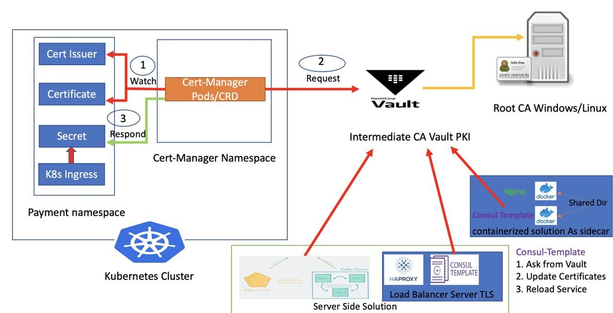
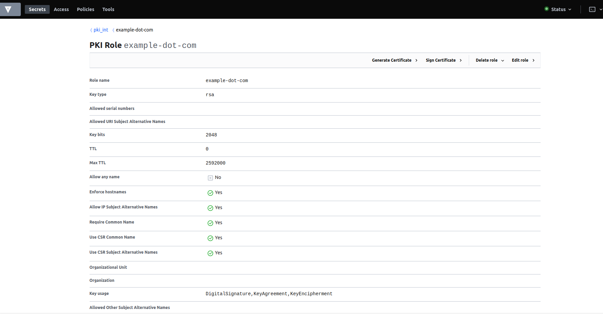
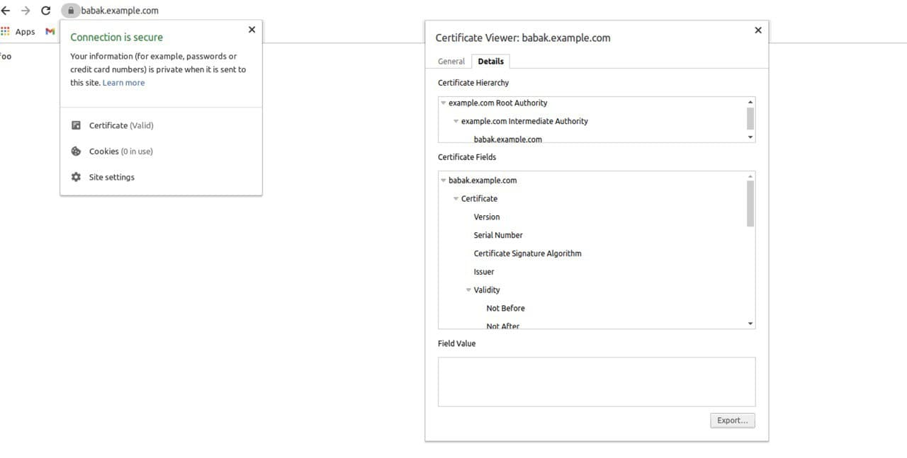

# Kubernetes Ingress SSL/TLS Automation - PKI as a Service with Vault and Cert Manager

## What we want to achieve
                                                    PKI Production Architecture  
 

For understanding this github repo every individual needs to know certificates, pki architecture, docker, kubernetes, ingress-nginx, cert-manager, vault pki-engine, vault approle auth  and bash scripting. It is prepared for demo purposes. In Production environment you should use helm package manager for k8s deployments and also can use helm sops/git-secret for encrypt role_id in VSC. Other important case that you should consider an external Root CA to sign the intermediate CA. It is recommended solution from security perspective.

## Tools I use for demo purposes:
[Kind](https://kind.sigs.k8s.io) - tool for running local Kubernetes clusters using Docker container “nodes”.<br/>
[Cert-Manager](https://cert-manager.io/docs/) -  native Kubernetes certificate management controller<br/>
[Vault](https://www.vaultproject.io) - Secure, store and tightly control access to tokens, passwords, certificates, encryption keys for protecting secrets and other sensitive data using a UI, CLI, or HTTP API<br/>
[Docker](https://www.docker.com) - Help developers and development teams build and ship apps<br/>
[consul-emplate](https://github.com/hashicorp/consul-template) - The daemon consul-template queries a Consul or Vault cluster and updates any number of specified templates on the file system. As an added bonus, it can optionally run arbitrary commands when the update process completes<br/>
[Jq](https://stedolan.github.io/jq/) - is a lightweight and flexible command-line JSON processor<br/>
[Curl](https://curl.se/) - command line tool and library for transferring data with URLs

## Warning 
There some k8s apis, vault, cert-manager versions may not be supported for your exist environment. It depends on your k8s enviroment. Approle role id is not supported yet as k8s secret in cert-manager issuer api.

## Start Kind k8s cluster
``` 
$ kind create cluster

$ kubectl cluster-info --context kind-kind

$ kubectl='kubectl  --context kind-kind'

$ kubectl get nodes
NAME                 STATUS   ROLES    AGE   VERSION
kind-control-plane   Ready    master   62s   v1.19.1
```

## Start Vault, Enable PKI Engine/Approle authentication mechanism, Generate Sample Certificate and Test Out Some PKI Commands
All detailed steps were defined  in script file as comment. Root CA - For the purpose of this demo, we’ll generate our own Root Certificate Authority within Vault. In a production environment, you should use an external Root CA to sign the intermediate CA that Vault will use to generate certificates
``` 
$ cd  vault/

# Start Vault
$ ./01_step.sh 

#  Enable Root CA and Intermediate CA(example.com)
$ ./02_step.sh

# Create Role, Policy and Approle Auth for Intermediate CA
$ ./03_step.sh

# Generate Example Certificate(test.example.com). You can see these certificates in certs directory
$ ./04_step.sh

# List Generated certficate
$ ls ./certs/
test.example.key  test.example.pem

# Read Generated certificate
$ openssl x509 -in certs/test.example.pem -text  -noout | head -11
Certificate:
    Data:
        Version: 3 (0x2)
        Serial Number:
            7a:7a:a2:5d:1c:98:97:38:b0:a2:36:00:b0:33:7a:67:02:93:2f:0a
        Signature Algorithm: sha256WithRSAEncryption
        Issuer: CN = example.com Intermediate Authority
        Validity
            Not Before: Jan  4 00:10:08 2021 GMT
            Not After : Feb  3 00:10:37 2021 GMT
        Subject: CN = test.example.com

# Vault list, read, revoke , delete certificate  commands
$ ./05_step.sh

# Destroy Vault Files
$ ./06_step.sh
```
Keep in mind role and secret id for k8s certmanager authenticate to vault pki_int

## Install Nginx Ingress, Cert-Manager, Cert-Manager Issuer/Certificate manifest files and  Sample-app which enabled ingress https endpoint
``` 
cd ../in_kubernetes_with_certmanager/

# Install Nginx Ingress
$ kubectl apply -f 01_nginx-ingress.yaml 

$ kubectl wait --namespace ingress-nginx --for=condition=ready pod   --selector=app.kubernetes.io/component=controller  --timeout=90s
pod/ingress-nginx-controller-79b66c4847-q2zcb condition met

# Install Cert-Manager
$ kubectl apply -f 02_cert-manager.yaml

$ kubectl get pods  -n cert-manager
NAME                                      READY   STATUS    RESTARTS   AGE
cert-manager-cainjector-fc6c787db-cmmfp   1/1     Running   0          51s
cert-manager-d994d94d7-ljtnp              1/1     Running   0          51s
cert-manager-webhook-845d9df8bf-tsqnc     1/1     Running   0          51s

# Change output of below command in  03_cert-manager-vault-approle.yaml file and then apply to k8s. 
$ echo -n  $(cat ../vault/secret_id) | base64
$ kubectl apply -f 03_cert-manager-vault-approle.yaml 

# Change roleid in and Vault endpoint url  04_issuer.yaml file and then apply to k8s. This is used by Cert-Manager Issuer Api in which  authenticate to Vault
$ cat ../vault/role_id
$ kubectl apply -f  04_issuer.yaml

# Check Issuer works as expected. If Ready Column is false then you can use describe command for troubleshooting
$ kubectl get issuer                                 
NAME           READY   AGE
vault-issuer   True    86s

# Apply 05_certificate.yaml file for getting certificate(intermediate ca pem, public and private key for babak.example.com )from Vault and it will create  automatically secret for Ingress Rule
$ kubectl apply -f 05_certificate.yaml 
certificate.cert-manager.io/foo created

$ kubectl get Certificate       
NAME   READY   SECRET    AGE
foo    True    foo-tls   13s

# Excellent! We see foo-tls secret for ingress rule
$ kubectl get secret | grep foo-tls
foo-tls                      kubernetes.io/tls                     3      51s

# You can see content of certificate as below, Intermediate CA from Issued Root CA
$ kubectl get secret  grep foo-tls -o yaml | grep ca.crt: |  awk '{print $2}' | head -1 | base64 -d | openssl x509 -in /dev/stdin -text -noout | head -11
Certificate:
    Data:
        Version: 3 (0x2)
        Serial Number:
            18:2e:be:f3:6c:4a:ac:b3:8c:61:af:ed:07:51:68:de:88:67:23:ad
        Signature Algorithm: sha256WithRSAEncryption
        Issuer: CN = example.com Root Authority
        Validity
            Not Before: Jan  4 00:08:38 2021 GMT
            Not After : Jan  3 00:09:08 2026 GMT
        Subject: CN = example.com Intermediate Authority

# Client Certificate from Issued Itermediate CA
$ kubectl get secret  grep foo-tls -o yaml | grep tls.crt: | awk '{print $2}' | head -1 | base64 -d | openssl x509 -in /dev/stdin -text -noout | head -11 
Certificate:
    Data:
        Version: 3 (0x2)
        Serial Number:
            73:0f:c9:19:e2:d1:f9:1d:85:e5:7d:83:19:0f:56:e1:fa:c5:66:02
        Signature Algorithm: sha256WithRSAEncryption
        Issuer: CN = example.com Intermediate Authority
        Validity
            Not Before: Jan  4 00:59:21 2021 GMT
            Not After : Feb  3 00:59:51 2021 GMT
        Subject: CN = babak.example.com

# Apply Sample-app which enabled ingress https endpoint
$ kubectl apply -f 06_sample-app.yaml 
pod/foo-app created
service/foo-service created
ingress.networking.k8s.io/example-ingress created

$ kubectl get pods 
NAME      READY   STATUS    RESTARTS   AGE
foo-app   1/1     Running   0          26s

# You will se https endpoint(443) enabled automatically without errors
$  kubectl get ing 
NAME              CLASS    HOSTS               ADDRESS   PORTS     AGE
example-ingress   <none>   babak.example.com             80, 443   32s
``` 

## Result
Vault Side
 

Client Side


##  Have Fun :blush: :relaxed:

## References:
[What is PKI](https://securityboulevard.com/2020/02/what-is-pki-a-crash-course-on-public-key-infrastructure-pki/)<br/>
[PKI Fundamentals video](https://www.youtube.com/watch?v=GQVSpHDfW4s)<br/>
[Configure CA in Linux](https://jamielinux.com/docs/openssl-certificate-authority/introduction.html)<br/>
[Configure CA in Windows](https://www.vkernel.ro/blog/building-a-three-tire-windows-certification-authority-hierarchy)<br/>
[Certificate Revocation List](https://en.wikipedia.org/wiki/Certificate_revocation_list)<br/>
[Online-certificate-status-protocol-ocsp-responder](https://www.vkernel.ro/blog/installing-and-configuring-a-microsoft-online-certificate-status-protocol-ocsp-responder)<br/>
[Practical-implementation-of-public-key-infrastructure](https://medium.com/cermati-tech/practical-implementation-of-public-key-infrastructure-at-cermati-104895d0692b)<br/>
[How-to-build-your-own-public-key-infrastructure](https://blog.cloudflare.com/how-to-build-your-own-public-key-infrastructure/)<br/>
[Vault PKI Engine](https://learn.hashicorp.com/tutorials/vault/pki-engine)<br/>
[Vault PKI](https://www.vaultproject.io/api-docs/secret/pki)<br/>
[Certificate-management-with-vault](https://www.hashicorp.com/blog/certificate-management-with-vault)<br/>
[Vault Approle Example](https://gist.github.com/greenbrian/5be10eb2c978a153a52caa9fadbc3b9c)<br/>
[Pki-as-a-service-with-hashicorp-vault-consul-template](https://medium.com/hashicorp-engineering/pki-as-a-service-with-hashicorp-vault-a8d075ece9a)<br/>
[Kubernetes Cert Manager](https://learn.hashicorp.com/tutorials/vault/kubernetes-cert-manager?in=vault/kubernetes)<br/>
[Demo Vault PKI Secret Engine Video](https://www.youtube.com/watch?v=4cEWxROsgW4&list=PL1NUqHkXctOMf7UbgVjnpJ1YdlgVm0DOS&index=2)<br/>
[Openshift CertManager Vault PKI](https://itnext.io/adding-security-layers-to-your-app-on-openshift-part-6-pki-as-a-service-with-vault-and-cert-e6dbbe7028c7)<br/>
[Dynamic-cer-management-with-k8s-cert-manager-and-vault-pki](https://medium.com/@selfieblue/dynamic-certificate-management-with-kubernetess-cert-manager-and-vault-pki-engine-d9ca4759512)<br/>
[Use-vault-pki-engine-for-dynamic-tls-certificates-on-GKE](https://www.arctiq.ca/our-blog/2019/4/1/how-to-use-vault-pki-engine-for-dynamic-tls-certificates-on-gke/)<br/>
[Consul-template-to-automate-certificate-management-vault-pki](https://tekanaid.com/posts/consul-template-to-automate-certificate-management-for-hashicorp-vault-pki/) <br/>
[Hashicorp-vault-pki-secrets-engine-demo-for-certificate-management](https://tekanaid.com/posts/hashicorp-vault-pki-secrets-engine-demo-for-certificate-management/)<br/>
[Securing Kafka with Vault PKI](https://www.youtube.com/watch?v=UajA8UftgfE)<br/>
[Vault to quickly and securely generate PKI (x509) and SSH certificates](https://www.hashicorp.com/resources/streamline-certificate-management-with-vault)<br/>
[Kubernetes-CertManager-Ingress-Nginx](https://www.digitalocean.com/community/tutorials/how-to-set-up-an-nginx-ingress-with-cert-manager-on-digitalocean-kubernetes)<br/>
[Secure-kubernetes-with-vault](https://koudingspawn.de/secure-kubernetes-with-vault/)<br/>
[Generate-cert-kubeadm-vault](https://banzaicloud.com/blog/generate-cert-kubeadm-vault/)<br/>
[Vault-and-kubernetes](https://www.digitalocean.com/blog/vault-and-kubernetes/)<br/>
[Istio with Vault-CA](https://istio.io/v1.2/docs/tasks/security/vault-ca/)<br/>
